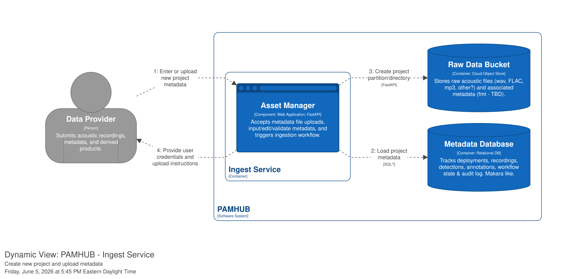
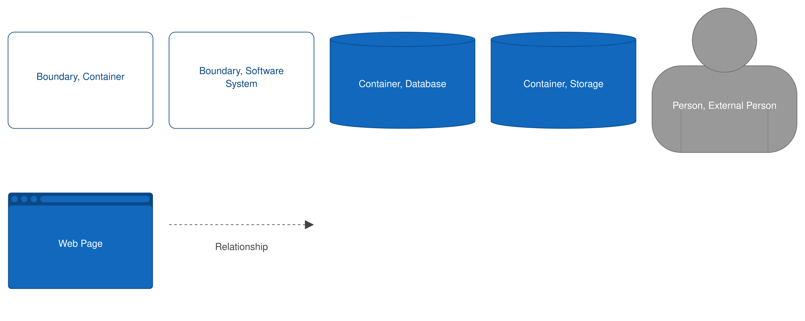

# Use Case: Create project metadata

**ID:** UC-012

## 1. Description

**Goal:** Enter or upload project metadata into the system.  

**Primary Actor:** Data Provider  

**Trigger:** Data Provider logs in to the system and selects "Create New Project"

**Pre-conditions:**

- Data provider has recovered PAM deployments (moorings, gliders, ship-mounted, etc.), downloaded data from the recorders and performed data backup.
- Data Provider has consulted [Makara Data Submission Guide](https://www.fisheries.noaa.gov/s3/2025-08/Makara-Data-Submission-Guide-508.pdf) and has all mandatory metadata (DEFINE THIS) available at their workstation.

**Priority:** 1 _([1, 2, 3, 4] High -> Low)_

## 2. Basic Flow (Happy Path)

1. Data Provider selects Create New Project.
2. System provides metadata entry form.
3. Actor types in mandatory project level metadata into the form.
4. System validates metadata.
5. Actor selects "Submit new project metadata".
6. System updates metadata database with the information provided.
7. System creates new partition in the `raw-data-upload` bucket for the raw audio files from the newly created project.

!!! QUESTION
    What about uploading pregenerated metadata as validated CSV or JSON files?  Decide on this feature.

## 3. Alternative / Exception Flows

### 3.1 [Condition A] (e.g., Invalid Login)

1. System displays error message.
2. Use case returns to Step 1 of Basic Flow.

### 3.2 [Condition B] (e.g., Out of Stock)

1. System suggests alternative products.
2. Use case terminates.

## 4. Special Requirements
[e.g., Response time must be under 2 seconds]
[e.g., Mobile responsive layout required]
