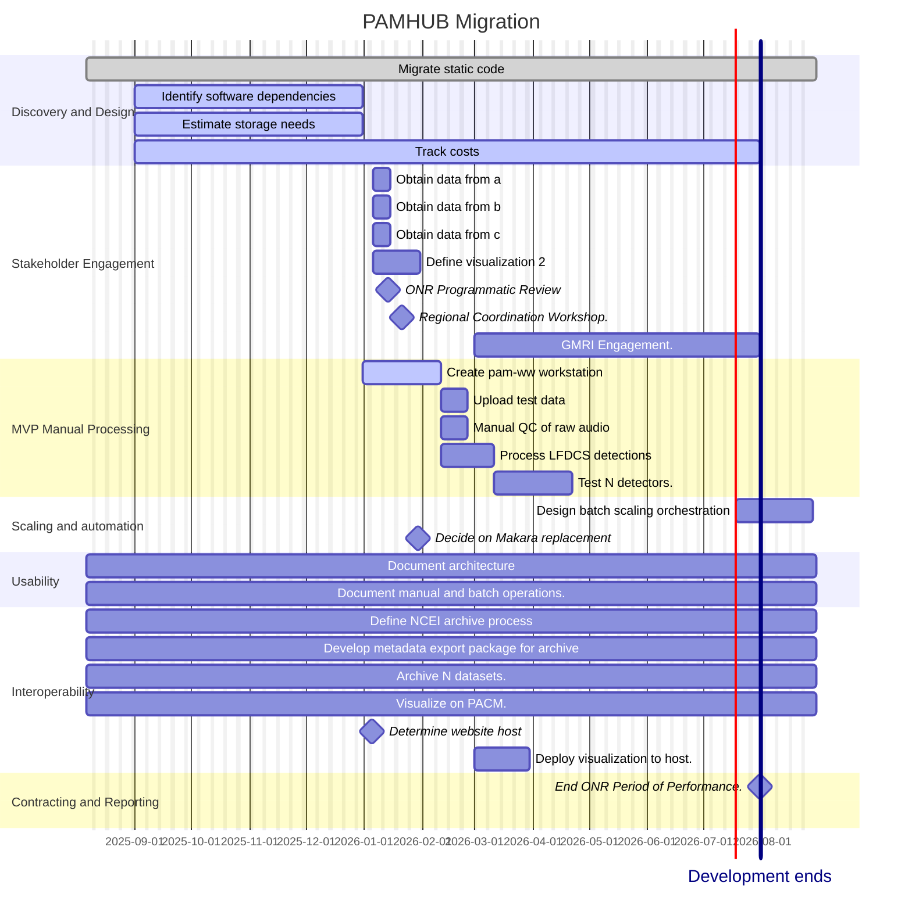

# High Level PAMHUB Roadmap 

This document describes the high level roadmap for PAMHUB development and decomposes the initial known User Stories into smaller increments that will be used for more detailed project planning.  Day to day project management will utilize Github Issues, Milestones, and Projects.

The envisioned Phases
- Phase 0 — (Discovery Phase) Requirements & design: map NOAA PAM-Cloud features to PAMHUB decisions.
- Phase 1 — MVP: ingest raw audio storage, manual quality control using cloud workstation (pam-ww) based detection processing, 
- Phase 2 — Scale & automation: batch scaling, queueing, operational maturity.
- Phase 3 — Usability: docs, onboarding workshops, example datasets for community use.
- Phase 4 — Interoperability: archival export templates and national compatibility.

Throughout the project there will be ongoing stakeholder engagement to identify new datasets for ingestion into the system and new products to be developed based on the PAMHUB data holdings.

- Stakeholder Outreach
  - [Data Providers](data-providers.md) 
  - Customers for derived products (see [User Story 004](us-004-visualizations) for initial product development goals.

- Develop Cloud Storage System
  - Upload small datasets
  - Upload large datasets
  - Upload metadata
  - Upload derived products
- Develop pam-ww cloud workstation 
  - Create windows based workstation
  - Install software dependencies
  - Negotiate licenses for software dependencies
- Develop batch scaling infrastructure
  - Decide on workflow orchetration architecture
  - Develop detector interface architecture (to support plug and play detectors in a workflow)
  - Create containers with dependencies
  - Reproduce manual workflows
- Create database infrastructure (if not Makara)
  - Collect requirements for each software dependency and NCEI
  - Create data model for each user story (or use case)
  - Determine metadata requirements for NCEI archiving
- Create derived products
  - Visualization system for HMD files
  - Visualization of HMD climatology

## User Stories 
References and decomposition into standalone tasks.  Original [User Stories](./PAM_Cloud_stories.docx.md).  NOTE: This file is not maintained.  It will be decomposed into smaller stories below and recorded as Issues.

### US-001 Archive raw audio at NCEI
Original reference: [User Story 001](us-001-archive-raw-audio.md)
- Archive raw audio 
  - Create deployment metadata
  - Upload raw audio to cloud (large files via hard drive and small files via gsutils)
  - Quality control raw audio
  - Create raw audio archive package
  - Archive raw audio package at NCEI

### US-002 Create hybrid milli-decade (HMD) files and archive
Original reference: [User Story 002](us-002-create-HMD-files.md)

- Create hybrid milli-decade (HMD) files and archive
  - Create deployment metadata
  - Upload raw audio to cloud
  - Quality control raw audio
  - Launch pam-ww cloud workstation
  - Process raw audio with PyPAM
    - Create PyPAM config yaml files for deployment
    - Trigger PyPAM processing
    - Quality control PyPAM output
  - Archive HMD output at NCEI
    - Create HMD archive package
    - Archive HMD package at NCEI

## US-003 Create LFDCS Whale detections
Original reference: [User Story 003](us-003-lfdcs-whale-detections.md)

- Create LFDCS Whale detections, archive at NCEI, and publish to PACM 
  - Create deployment metdata
  - Upload raw audio to cloud
  - Quality control raw audio
  - Run LFDCS detector
    - Launch pam-ww cloud workstation
    - Create LFDCS config parameter file
    - Run LFDCS detector on pam-ww cloud workstation
  - Quality control LFDCS output
  - Create LFDCS archive package
  - Archive LFDCS archive package at NCEI
  - _Upload LFDCS detections to Makara and PACM (NOTE: To be verified)_

## US-004 Visualize HMD Climatology
[User Story 004](us-004-visualize-climatology)

 
From Jackie in Google Docs comments.  We'd like to start with a plotted climatology of HMD. This is helpful for observing variability and detecting anomalies, and it's also similar to our existing Climatology which we hope to integrate some of the data sets in the future. @xavier.mouy@whoi.edu has worked on this and has some code to share.

## US-005 Other Visualizations

Placeholder for additional derived products and visualizations to be defined through targetd stakeholder engagement.