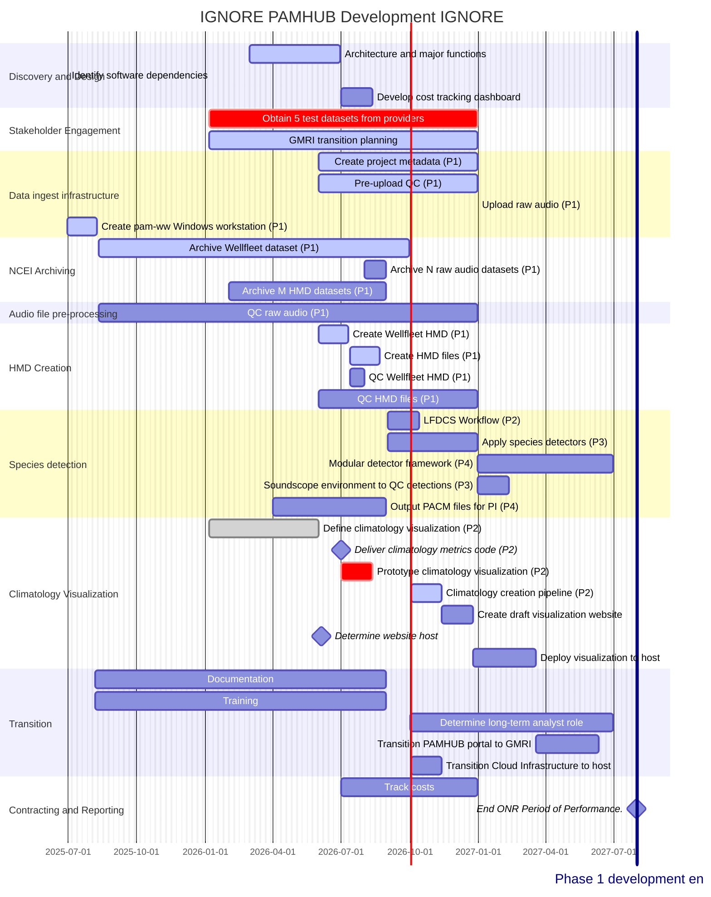

# High Level PAMHUB Roadmap 

This document describes the high level roadmap for PAMHUB development and lists the use cases that will be supported.  Day to day project management will utilize Github Issues, Milestones, and Projects.

```mermaid
gantt
    dateFormat  YYYY-MM-DD
    title       IGNORE PAMHUB Development IGNORE
    excludes    weekends
    %% (`excludes` accepts specific dates in YYYY-MM-DD format, days of the week ("sunday") or "weekends", but not the word "weekdays".)

    section Discovery and Design
    Architecture and major functions    :active,  dd1, 2026-03-01, 2026-06-30
    Identify software dependencies      :active,  dd2, 2026-03-01, 2025-06-30
    Develop cost tracking dashboard     :  cost, 2026-07-01, 30d

    section Stakeholder Engagement
    Obtain 5 test datasets from providers : crit, se1, 2026-01-06, 2026-12-31
    GMRI transition planning           : active, se5, 2026-01-06, 2026-12-31

    section Data ingest infrastructure
    Create project metadata (P1) : active, uc-012, 2026-06-01, 2026-12-31
    Pre-upload QC (P1) : active, uc-011, 2026-06-01, 2026-12-31
    Upload raw audio (P1) : active, uc-005, after uc-011, 2026-12-31
    Create pam-ww Windows workstation (P1)    : active, pam-ww, after dd2, 30d

    section NCEI Archiving
    Archive Wellfleet dataset (P1) : active, wellfleet-archive, after pam-ww, 2026-09-30
    Archive N raw audio datasets (P1) : uc-001, 2026-08-01, 2026-08-30
    Archive M HMD datasets (P1)  : uc-014, 2026-02-01, 2026-08-30

    section Audio file pre-processing
    QC raw audio (P1) : uc-007, after pam-ww, 2026-12-31

    section HMD Creation 
    Create Wellfleet HMD (P1) : active, well-hmd, 2026-06-01, 30d 
    Create HMD files (P1)     : active, uc-002, after well-hmd, 30d
    QC Wellfleet HMD (P1)  : well-hmd-qc, after well-hmd, 15d
    QC HMD files     (P1)  : uc-013, 2026-06-01, 2026-12-31 

    section Species detection
    LFDCS Workflow (P2) : lfdcs, 2026-09-01, 30d
    Apply species detectors (P3) : uc-003, 2026-09-01, 2026-12-31
    Modular detector framework (P4) : 2026-12-31, 2027-06-30
    Soundscope environment to QC detections (P3) : soundscope, after uc-003, 30d
    Output PACM files for PI (P4)   : 2026-04-01, 2026-08-30

    section Climatology Visualization
    Define climatology visualization (P2) : done, se4, 2026-01-06, 2026-06-01
    Deliver climatology metrics code (P2) : milestone, clim-code, 2026-07-01, 0d
    Prototype climatology visualization (P2): crit, after clim-code, 30d 
    Climatology creation pipeline (P2) : active, uc-004, after clim-proto, 30d 
    Create draft visualization website : v1, after uc-004, 30d
    Determine website host : milestone, m2, 2026-06-05, 0d
    Deploy visualization to host      : v3, after v1, 60d

    section Transition
    Documentation         :  2025-08-06, 2026-08-30
    Training         : u1, 2025-08-06,2026-08-30
    Determine long-term analyst role  : t1, 2026-10-01, 2027-06-30
    Transition PAMHUB portal to GMRI  : t2, after v3, 60d
    Transition Cloud Infrastructure to host : t3, after s3, 30d

    section Contracting and Reporting
    Track costs                         :  cost, 2026-07-01, 2026-12-31
    End ONR Period of Performance.  : milestone, 2027-07-31,0d
    Phase 1 development ends : vert, 2026-12-31

```

## Draft Milestone Plan

### Assumptions

The following assumptions inform the milestone plan below.  They will be revisited periodically and if they change, the milestone plan will be uploaded accordingly.

- The windows workstation is required for initial development of the quality control procedures and the archiving pipeline.  But, the long term goal is to have the entire workflow ported to Python packages accessible via the JupyterHub environment.
- MVP will be the focus of the initial development between June-Dec 2026.  Refinements and improvements will be captured during this phase but not implemented until after Jan 2027.  

### Milestones

1. Discovery and Design

Ensure use cases are fully understood by the team and sequenced by priority and dependencies.  Identify any outstanding information we need for subsequent stages.

- See Github [milestone 1](https://github.com/asascience-open/pam-cloud/milestone/1)

1. Data ingest infrastructure

Several (3-5?) data sets uploaded to the cloud and documentation has been written explaining the upload process and identifying any challenges experienced during the intial phase.  Basic metadata creation tool is complete and the metadata is manually entered into the system through a web form and is loaded into the database.  Basic pre-upload QC implemented, possibly as a client side script. Refinements to tools are recorded for future releases.

    - uc-012
    - uc-011
    - uc-005

1. Audio file pre-processing
Prior to calculation of HMD, quality control procedures of raw audio files is done via manual data analysis in the cloud environment (e.g. windows workstation running Raven or other audio file analysis.).  Data preparation tasks are complete (e.g. format conversion from \*.wave to \*.flac etc.)

    - uc-007

1. HMD Creation
HMD files are created using the Dagster PyPAM/PBP pipeline.  Quality control is performed on HMD files.  Role of PI vs PAM Analyst is clarified wrt QC.

    - uc-002
    - uc-013

1. NCEI Archiving
Example data sets have been moved through the archive process manually by the PAM Analyst.  Required software tools are installed on the windows workstation and, where applicable, in the JupyterHub.  POC for each archive process is established and the metadata requirements are documented and reconciled with the metadata entry tool and any other configuration metadata needed for product development. Relationship between archiving raw audio vs archiving HMD files is clearly documented (e.g. one package or two?)

    - uc-001
    - uc-014

1. Species detection
LFDCS detection pipeline is developed and applied to test data sets (MVP). Other species detectors are incorporated into the pipeline following user priorization (post-MVP). Python framework for plug and play species detectors is scoped and level of effort is determined.  Governance of species detection approvals is documented and the implementation of approval tools is tested with one or more PI's.

    - uc-003
    - Develop modular detector framework
