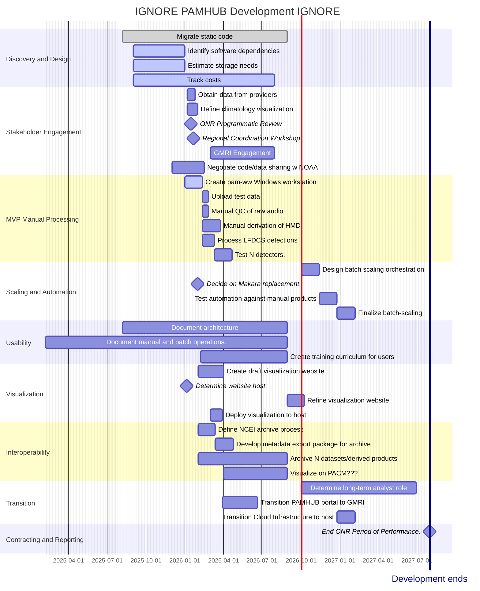

# High Level PAMHUB Roadmap 

This document describes the high level roadmap for PAMHUB development and lists the use cases that will be supported.  Day to day project management will utilize Github Issues, Milestones, and Projects.

```mermaid
gantt
    dateFormat  YYYY-MM-DD
    title       IGNORE PAMHUB Development IGNORE
    excludes    weekends
    %% (`excludes` accepts specific dates in YYYY-MM-DD format, days of the week ("sunday") or "weekends", but not the word "weekdays".)

    section Discovery and Design
    Migrate static code                 :done,    dd1, 2025-08-06,2026-08-30
    Identify software dependencies      :active,  dd2, 2025-09-01, 2025-12-31
    Estimate storage needs              :active,  dd3, 2025-09-01, 2025-12-31
    Track costs                         :active,  cost, 2025-09-01, 2026-07-31

    section Stakeholder Engagement
    Obtain data from providers : se1, 2026-01-06,14d
    Define climatology visualization  : se4, 2026-01-06, 2026-01-31
    ONR Programmatic Review           :milestone, 2026-01-14, 0d
    Regional Coordination Workshop    : milestone, 2026-01-21, 0d
    GMRI Engagement           : se5, 2026-03-01, 2026-07-31
    Negotiate code/data sharing w NOAA  : se6, 2025-12-01, 2026-02-15

    section MVP Manual Processing
    Create pam-ww Windows workstation     :active, man1, after dd2, 30d
    Upload test data          : man2, after man1  , 10d
    Manual QC of raw audio    : man3, after man1  , 10d
    Manual derivation of HMD  : man6, after man1, 30d
    Process LFDCS detections  : man4, after man1, 20d
    Test N detectors.         : man5, after man4, 30d

    section Scaling and Automation
    Design batch scaling orchestration             :s1, after doc1, 30d
    Decide on Makara replacement      :milestone, 2026-01-30, 0d
    Test automation against manual products : s3, after s1, 30d
    Finalize batch-scaling    : s4, after s3, 30d

    section Usability
    Document architecture         : u1, 2025-08-06,2026-08-30
    Document manual and batch operations. : u2, 2025-02-06,2026-08-30
    Create training curriculum for users  : u3, 2026-02-06,2026-08-30

    section Visualization
    Create draft visualization website : v1, 2026-02-01, 2026-04-01
    Determine website host : milestone, m2, 2026-01-05, 0d
    Refine visualization website   : v2, after u3, 30d
    Deploy visualization to host      : v3, 2026-03-01, 2026-03-30

    section Interoperability
    Define NCEI archive process : i1, 2026-02-01, 30d
    Develop metadata export package for archive : i2, after i1, 30d
    Archive N datasets/derived products  : i3, 2026-02-01, 2026-08-30
    Visualize on PACM???   : 2026-04-01, 2026-08-30

    section Transition
    Determine long-term analyst role  : t1, 2026-10-01, 2027-06-30
    Transition PAMHUB portal to GMRI  : t2, after v3, 60d
    Transition Cloud Infrastructure to host : t3, after s3, 30d

    section Contracting and Reporting
    End ONR Period of Performance.  : milestone, 2027-07-31,0d
    Development ends : vert, 2027-06-01

```

## Use Cases

References and decomposition into standalone tasks.  Original [User Stories](./PAM_Cloud_stories.docx.md).  NOTE: This file is not maintained.  It has been decomposed into smaller stories or use cases below.

| UC ID | Use Case write up  | Related Issues |
|------|---------------------|----------------|
| uc-001 | [Archive at NCEI](./uc-001-archive-pam-data-at-ncei.md) | NA|
| uc-002 | [Calculate spectograms w PyPAM](./uc-002-calculate-spectrograms.md) | NA|
| uc-003 | [Apply species detectors](./uc-003-detect-species-presence.md) | NA|
| uc-004 | [Visualize climatology](./uc-004-visualize-spectrogram-climatology.md) | NA|
| uc-005 | [Upload data](./uc-005-upload-raw-data-to-pamhub.md) | NA|
| uc-006 | [Visualize other](./uc-006-visualizations-other.md) | NA|
| uc-007 | [Quality control raw audio](./uc-007-quality-control-raw-audio.md) | NA|
| uc-008 | [Publish detections to PACM and/or NCEI](./uc-008-publish-detections.md) | NA |
| uc-0 | [Integrate internal SoundScope visualization](./uc-009-soundscope-integration.md) | NA |
| uc-0 | [Provide analysis environment to external PIs/Data providers](./uc-010-external-investigator-analysis.md) | NA |
| uc-0 | [QC check prior to data upload](./uc-011-pre-upload-integrity-check.md) | NA |

Other use cases we have/are considering:

1. Archive Spectograms/HMD files
2. Quality control raw data as an automated process
3. Archive detections